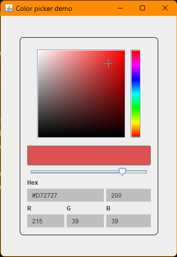

# ColorPicker
A Java Swing component for picking colors with a very
nice-looking GUI. This component uses [MigLayout](https://github.com/mikaelgrev/miglayout) to position components.

### Preview


### Usage
- Java 21 😢
- <code>ColorPicker</code> has a few constructors to configure the 
JPanels radius.
- <code>ColorPicker</code> subclasses JPanel.
- <code>ColorPickerListener</code> has more listener action other than
<code>onColorChanged()</code>
```Java
void demo() {
    ColorPicker picker = new ColorPicker(15);
    picker.setTextFieldBorder(new EmptyBorder(5, 10, 5, 10));
    picker.addColorPickerListener(new ColorPickerListener() {
        @Override
        public void onColorChanged(Color newColor) {
            System.out.println("New Color: " + newColor);
        }
    });
    // Add ColorPicker to a Component
}
```

### Dependencies
- Miglayout
- JUnit (testing)

### Upcoming Updates
- Maven package
- Support for older Java versions
- Eye dropper
- Color history

### Licence
This repo uses M.I.T licensing, so feel free to go wild
with this JComponent, though,  crediting will be appreciated :) 
